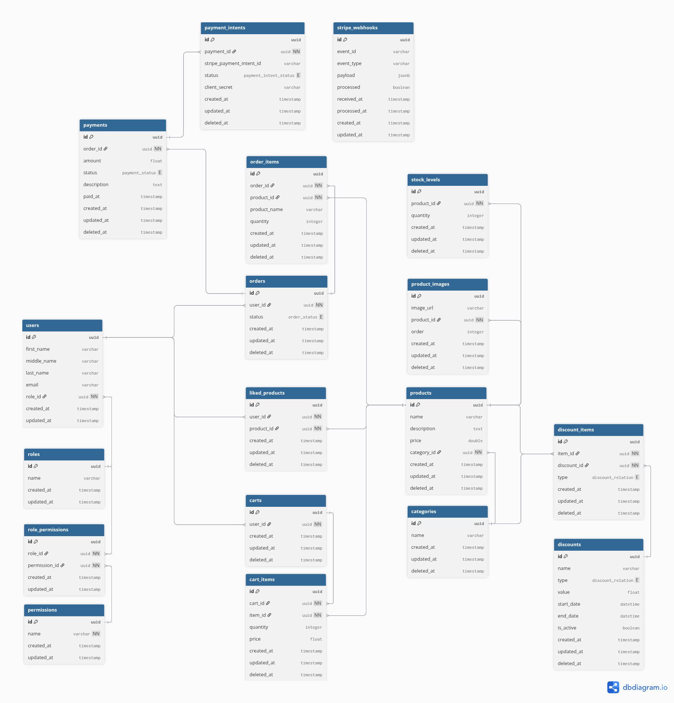

<p align="center" style="background-color:white">
 <a href="https://www.ravn.co/" rel="noopener">
 </a>
</p>
<p align="center">
 <a href="https://www.postgresql.org/" rel="noopener">
 </a>
</p>

---

<p align="center">A project to show off your skills on databases & SQL using a real database</p>

## 📝 Table of Contents

- [Case](#case)
- [Installation](#installation)
- [Data Recovery](#data_recovery)
- [Excersises](#excersises)

## 🤓 Case <a name = "case"></a>

As a developer and expert on SQL, you were contacted by a company that needs your help to manage their database which runs on PostgreSQL. The database provided contains four entities: Employee, Office, Countries and States. The company has different headquarters in various places around the world, in turn, each headquarters has a group of employees of which it is hierarchically organized and each employee may have a supervisor. You are also provided with the following Entity Relationship Diagram (ERD)

#### ERD - Diagram <br>

 <br>

---

## 🛠️ Docker Installation <a name = "installation"></a>

1. Install [docker](https://docs.docker.com/engine/install/)

---

## 📚 Recover the data to your machine <a name = "data_recovery"></a>

Open your terminal and run the follows commands:

1. This will create a container for postgresql:

```
docker run --name nerdery-container -e POSTGRES_PASSWORD=password123 -p 5432:5432 -d --rm postgres:15.2
```

2. Now, we access the container:

```
docker exec -it -u postgres nerdery-container psql
```

3. Create the database:

```
create database nerdery_challenge;
```

5. Close the database connection:

```
\q
```

4. Restore de postgres backup file

```
cat /.../dump.sql | docker exec -i nerdery-container psql -U postgres -d nerdery_challenge
```

- Note: The `...` mean the location where the src folder is located on your computer
- Your data is now on your database to use for the challenge

---

## 📊 Excersises <a name = "excersises"></a>

Now it's your turn to write SQL queries to achieve the following results (You need to write the query in the section `Your query here` on each question):

1. Total money of all the accounts group by types.

```
SELECT type, SUM(mount)
FROM accounts
GROUP BY type;
```

2. How many users with at least 2 `CURRENT_ACCOUNT`.

```
SELECT COUNT(*) AS users_with_multiple_accounts
FROM (
    SELECT u.id
    FROM users u
    JOIN accounts a ON u.id = a.user_id
    GROUP BY u.id
    HAVING COUNT(*) >= 2
) sub;
```

3. List the top five accounts with more money.

```
SELECT account_id, mount
FROM accounts
ORDER BY mount DESC
LIMIT 5;

```

4. Get the three users with the most money after making movements.
   > **NOTE**:
   > For exercises 4 and 7, I implemented a temporary table.

```
CREATE TEMP TABLE temp_user_balances AS
WITH Inflow AS (
    SELECT a.user_id, SUM(m.mount) AS total_received
    FROM movements m
    JOIN accounts a ON m.account_to = a.id
    GROUP BY a.user_id
),
Deposits AS (
    SELECT a.user_id, SUM(m.mount) AS total_deposits
    FROM movements m
    JOIN accounts a ON m.account_from = a.id
    WHERE m.type IN ('IN')
    GROUP BY a.user_id
),
InitialBalances AS (
    SELECT user_id, SUM(mount) AS initial_total
    FROM accounts
    GROUP BY user_id
)
SELECT
    u.*,
    (
        COALESCE(ib.initial_total, 0)
      + COALESCE(inf.total_received, 0)
      + COALESCE(dep.total_deposits, 0)
    ) AS total_balance
FROM users u
LEFT JOIN InitialBalances ib ON u.id = ib.user_id
LEFT JOIN Inflow inf ON u.id = inf.user_id
LEFT JOIN Deposits dep ON u.id = dep.user_id;
```

Then, using that temp table the final query is:

```
SELECT
    name || ' ' || last_name AS user_full_name,
    email,
    total_balance
FROM temp_user_balances
ORDER BY total_balance DESC
LIMIT 3;
```

5.  In this part you need to create a transaction with the following steps:

    a. First, get the ammount for the account `3b79e403-c788-495a-a8ca-86ad7643afaf` and `fd244313-36e5-4a17-a27c-f8265bc46590` after all their movements.
    b. Add a new movement with the information:
    from: `3b79e403-c788-495a-a8ca-86ad7643afaf` make a transfer to `fd244313-36e5-4a17-a27c-f8265bc46590`
    mount: 50.75

    c. Add a new movement with the information:
    from: `3b79e403-c788-495a-a8ca-86ad7643afaf`
    type: OUT
    mount: 731823.56

        * Note: if the account does not have enough money you need to reject this insert and make a rollback for the entire transaction

    d. Put your answer here if the transaction fails(YES/NO):

    ```
        YES
    ```

    e. If the transaction fails, make the correction on step _c_ to avoid the failure:

    ```
        mount <= 5047.66
    ```

    f. Once the transaction is correct, make a commit

    ```
        Your query
    ```

    g. How much money the account `fd244313-36e5-4a17-a27c-f8265bc46590` have:

    ```
        3214
    ```

6.  All the movements and the user information with the account `3b79e403-c788-495a-a8ca-86ad7643afaf`

```
SELECT
    u.name || ' ' || u.last_name as account_user,
    u.email,
    a.account_id,
    m.type,
    m.mount
FROM users u
INNER JOIN accounts a ON a.user_id = u.id
LEFT JOIN movements m ON a.id = m.account_from or a.id = m.account_to
WHERE a.id = '3b79e403-c788-495a-a8ca-86ad7643afaf';
```

7. The name and email of the user with the highest money in all his/her accounts
   > **NOTE:** Using the temporary table created earlier.

```
SELECT
    name || ' ' || last_name as user_full_name,
    email,
    total_balance
FROM temp_user_balances
ORDER BY total_balance DESC
LIMIT 1;
```

8. Show all the movements for the user `Kaden.Gusikowski@gmail.com` order by account type and created_at on the movements table

```
SELECT
    a.type,
    m.created_at,
    m.mount
FROM users u
JOIN accounts a
    ON a.user_id = u.id
JOIN movements m
    ON m.account_from = a.id
    OR m.account_to = a.id
WHERE u.email ILIKE 'Kaden.Gusikowski@gmail.com'
ORDER BY
    a.type,
    m.created_at;
```
