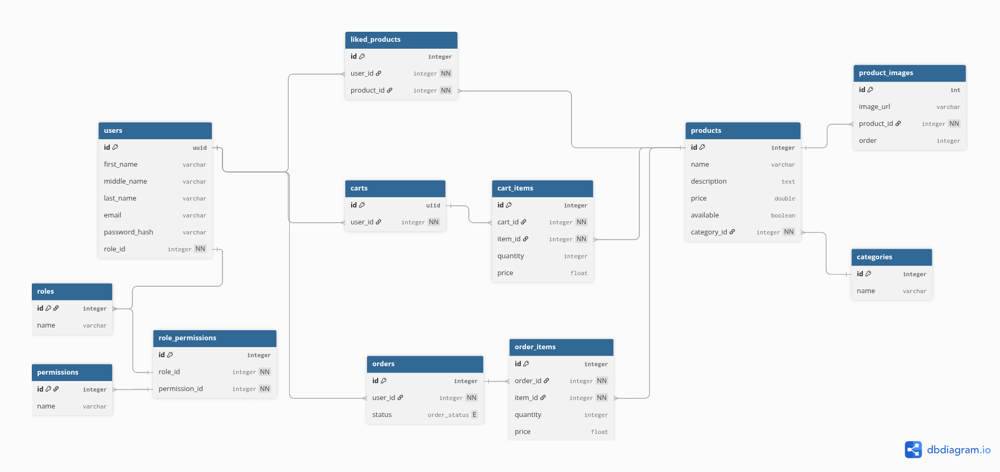

<p align="center" style="background-color:white">
 <a href="https://www.ravn.co/" rel="noopener">
 </a>
</p>
<p align="center">
 <a href="https://www.postgresql.org/" rel="noopener">
 </a>
</p>

# Nerdery Backend Challenge – ERD & Database Setup

This repository contains the **Entity Relationship Diagram (ERD)** and the **SQL scripts** required to support the backend requirements of the challenge.

---

## 📘 Overview

The proposed database design supports:

- Authentication (sign up, sign in, sign out, forgot/reset password)
- Role-based access (Manager, Client)
- Product management with images
- Product listing with pagination and category search
- Shopping cart and orders
- Product likes
- Stripe payment integration (including webhook handling)
- Public product visibility for both logged and non-logged users

### ERD - Diagram <br>

 <br>

---

## 🗂 Database Files

The SQL scripts are located:

- **create_role_permissions.sql**
  Creates roles and permissions used by the system.

- **create_db.sql**
  Creates all tables, relationships, constraints, and indexes defined in the ERD.

⚠️ **Important:**
You must execute `create_role_permissions.sql` **before** `create_db.sql`, because roles and permissions are referenced by other tables.

---

## 🐘 PostgreSQL Setup Tutorial

### 1. Create a PostgreSQL container

```
docker run --name nerdery-container \
  -e POSTGRES_PASSWORD=password123 \
  -p 5432:5432 \
  -d --rm postgres:13.0
```

---

### 2. Access the PostgreSQL container

```
docker exec -it -u postgres nerdery-container psql
```

---

### 3. Create the database

```
create database nerdery_challenge;
```

Exit `psql` after creation.

---

### 4. Restore the database structure

First, execute the roles and permissions script:

```
cat /.../src/create_role_permissions.sql | \
  docker exec -i nerdery-container psql -U postgres -d e_commerce
```

Then execute the main schema script:

```
cat /.../src/create_db.sql | \
  docker exec -i nerdery-container psql -U postgres -d e_commerce
```

> **Note:** `...` represents the local path where the `src` folder is located on your computer.

---
